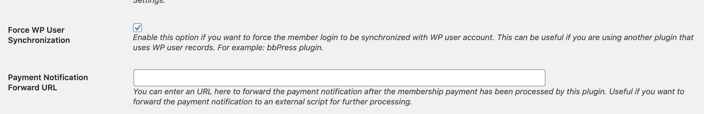
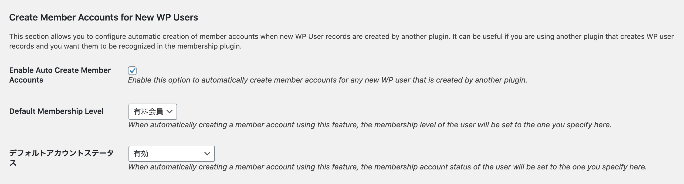
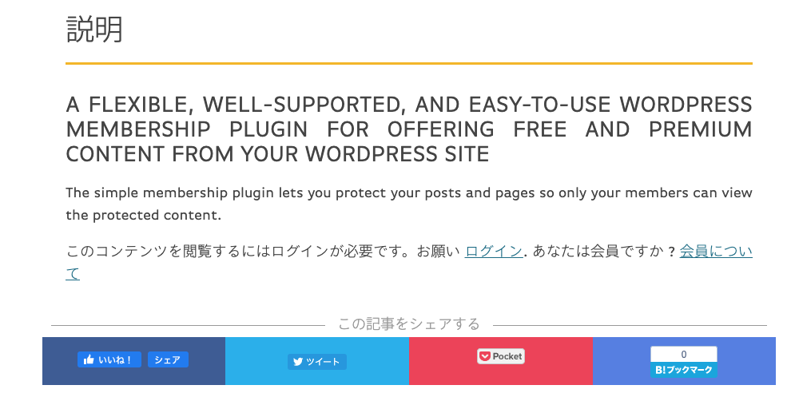

# Gianism SWPM Helper

GianismをSimple Membershipに連携させるためのサポートプラグイン

## 設定

[Simple Membership（SWPM）](https://ja.wordpress.org/plugins/simple-membership/)の設定で必要な項目は次のとおりです。

WP Membership > 設定 > 詳細設定 に移動してください。

1. **Force WP User Synchronization	** にチェックを入れてください。
2. **Enable Auto Create Member Accounts** にチェックを入れてください。





### ログインページにGianismのSNSボタンを出す

ショートコード `[gianism_login]` が利用可能です。

```
[gianism_login]
```

上記のコードをSWPMが作成した「メンバーログイン」ページに記載してください。

### 記事からの導線

SWPMでは「コンテンツの保護」という機能があります。保護されたコンテンツでは、次のような「コンテンツを非表示にし、ログインリンクを表示する」という機能があります。



リンクをクリックしたユーザーにとって自然な導線は以下になります。

1. Google検索やSNSでコンテンツ保護されたページにたどり着く
2. 記事を読みたいと思ったので、「ログイン」をクリックする
3. SNSでログインを済ませると、記事ページに戻って続きから読むことができる。

本プラグインを有効化すると、次のような挙動になります。

- 閲覧制限をされたページでログインをクリックし、SNSログインすると、元いたページに戻る。
- それ以外のページでSNSログインをすると、SWPMのプロフィールページに移動する

### 接続の管理

SNS連携でログインできるサイトでは、多くの場合、SNS連携の解除ができるのが普通です。Gianismではこの機能を2通りのやり方で提供しています。

1. `wp-admin/profile.php` のプロフィール画面から管理
2. ショートコード `gianism_connection` で管理

ログインボタン同様、プラグインが提供する固定ページ `/membership-login/membership-profile` にショートコードを記載してください。
